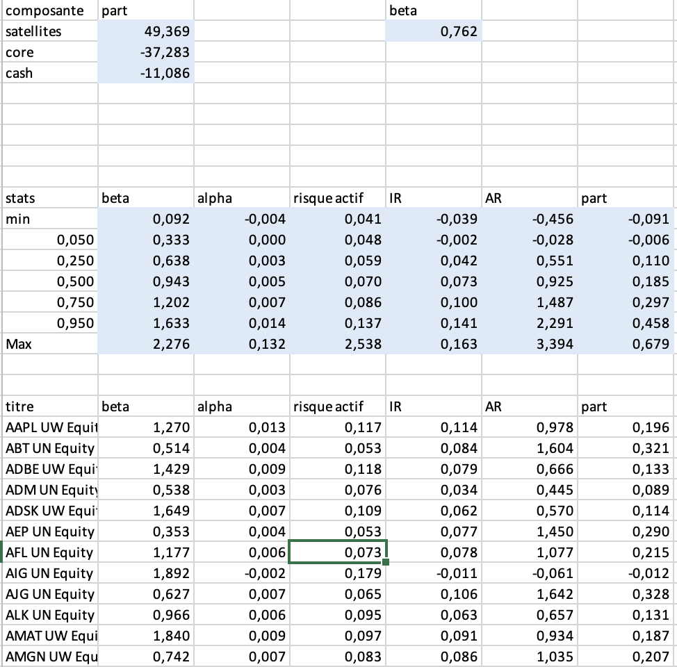

# Core Satellites
Modèle d'allocation d'actifs basé sur la stratégie Core-Satellites

## Introduction

**Core Satellites** est un projet VBA visant à mettre en œuvre un modèle d'allocation d'actifs basé sur la stratégie Core-Satellites. Ce modèle permet de combiner un portefeuille central (Core) et un portefeuille satellite composé de titres sélectionnés. Le modèle analyse les rendements de ces titres et des indices associés pour déterminer une allocation optimale en fonction des objectifs de risque et de rendement.

---

## 📂 **Fichier de Données**

Le fichier Excel contient trois feuilles de données principales :
1. **Actions** : Contient les rendements des actions pour la gestion active.
2. **Indice de Marché** : Contient les rendements de l'indice de marché de référence.
3. **Indice Monétaire** : Contient les rendements de l'indice monétaire pour l'équilibre budgétaire.

Le projet utilise plusieurs modules VBA pour effectuer les calculs nécessaires à la stratégie Core-Satellites.

### **Structure des Données**
- **Feuille "actions"** : Rendements des actions sélectionnées pour la gestion active.
- **Feuille "indice_mkt"** : Rendements de l'indice de marché.
- **Feuille "indice_monetaire"** : Rendements de l'indice monétaire utilisé pour l'équilibre budgétaire.

---

## 🗂️ **Description du Projet**

## 🚀 **Fonctionnalités**

### 1. **Récupération et Préparation des Données**
Le premier module permet de récupérer les rendements des titres, de l'indice de marché, et de l'indice monétaire pour le calcul de l'allocation Core-Satellites.
- **main** : Ce module récupère les rendements des trois ensembles de données (actions, indice de marché, indice monétaire) et les prépare pour les étapes suivantes du calcul.

### 2. **Calcul de l'Allocation Core-Satellites**
Une fois les données récupérées, le modèle calcule l'allocation optimale en utilisant la stratégie Core-Satellites.
- **coreSatellites** : Le module calcule l'allocation optimale des titres en fonction de leur alpha, beta, et de leurs rendements associés. Il génère également des statistiques comme les ratios d'Information Ratio (IR) et Appraisal Ratio (AR), et calcule les parts des titres (core, satellites et cash).
- Le module génère un tableau récapitulatif dans la feuille "core-satellites" avec les résultats de l'allocation, les risques associés, et les contributions à la performance.

---

## 🛠️ **Méthodologie**

### **Étapes de Calcul :**

1. **Récupération des Données :**
   - Les données sont récupérées depuis les feuilles Excel ("actions", "indice_mkt", "indice_monetaire").
   - Les rendements des titres et des indices sont extraits et convertis en séries de rendements.

2. **Estimation des Alphas et Betas :**
   - Le modèle utilise la méthode du CAPM pour estimer les alphas et les betas des titres.
   - Les rendements des actions sont comparés à ceux de l'indice de marché et de l'indice monétaire.

3. **Calcul de l'Allocation Core-Satellites :**
   - L'allocation des titres satellites est optimisée en fonction des alphas, des betas et des rendements, en prenant en compte un facteur d'aversion au risque.
   - Les parts de chaque titre, du portefeuille core et de la position en cash sont calculées.

4. **Calcul des Statistiques de Performance :**
   - **Alpha** : Mesure de la performance excédentaire par rapport au modèle CAPM.
   - **Beta** : Mesure du risque systématique par rapport à l'indice de marché.
   - **Information Ratio (IR)** : Mesure de la rentabilité ajustée du risque.
   - **Appraisal Ratio (AR)** : Mesure de l'efficacité de l'alpha par rapport au risque.
   - Le modèle calcule également les rendements minimum, maximum, et les percentiles de ces statistiques.

---

## 📊 **Résultat Final**
Le tableau final (dans la feuille "core-satellites") comprend :
1. **Allocation des titres** : Core, Satellites, et Cash.
2. **Statistiques de Performance** : Alpha, Beta, IR, AR, Risque Actif.
3. **Résumé des résultats** : Poids des titres dans le portefeuille, beta ciblé, et statistiques de performance.

---

## 📌 **Prérequis et Installation**

### **Prérequis :**
- Microsoft Excel (version prenant en charge les macros VBA).
- Activer les macros dans Excel (Options > Centre de gestion de la confidentialité > Paramètres des macros).

### **Installation :**
1. Télécharger ou cloner ce dépôt GitHub.
2. Ouvrir le fichier `Core_Satellites.xlsm`.
3. Suivre les étapes d’exécution des macros via l’interface utilisateur Excel.

---

## 🧑‍💻 **Utilisation**

1. Exécuter la macro `main` pour récupérer les données et initialiser les calculs.
2. Vérifier les données récupérées dans les feuilles "actions", "indice_mkt", et "indice_monetaire".
3. Exécuter la macro `coreSatellites` pour générer l'allocation Core-Satellites.
4. Analyser les résultats dans la feuille "core-satellites", qui contient l'allocation des titres et les statistiques de performance.

---

## 📄 **Modules VBA**
1. **main** : Module principal qui récupère les données des actions, de l'indice de marché et de l'indice monétaire, puis les prépare pour les calculs.
2. **imp_data** : Module permettant d’importer les valeurs des plages de données et de les organiser.
3. **coreSatellites** : Module qui calcule l'allocation Core-Satellites, en prenant en compte les rendements et les risques des titres et des indices.
4. **calcul_alphas** : Module pour estimer les alphas et betas des titres en utilisant le modèle CAPM.
5. **calcul_rendements** : Module pour calculer les rendements à partir des valeurs initiales.
